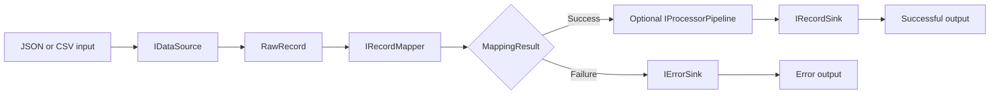

# DataPipeline

A small, extensible data-processing pipeline written in C#.

DataPipeline reads records from structured input sources, converts them into a common `RawRecord` representation, maps and validates them as domain objects, optionally applies a sequence of transformations, and routes successful records and mapping errors to separate outputs.

The project is designed around small interchangeable components, allowing input formats, mapping rules, processing logic, and output targets to be changed independently.

## Features

- CSV and JSON data sources
- Asynchronous record streaming with `IAsyncEnumerable<T>`
- Shared `RawRecord` representation for different input formats
- Custom mapping and validation through `IRecordMapper<T>`
- Explicit mapping failures through `MappingResult<T>`
- Sequential object processing through `IProcessorPipeline<T>`
- Fluent processing DSL with:
  - `.Transform(...)`
  - `.If(...).Then(...)`
- Optional processing pipeline
- Separate sinks for successful records and mapping errors
- Incremental JSON output with `Utf8JsonWriter`
- Cancellation support through `CancellationToken`
- Execution statistics:
  - total records
  - successful records
  - failed records
  - processing duration
- Generic components reusable with different domain models
- NUnit test suite covering individual components and integration scenarios
- Separate demo application using the library as a consumer

## Processing flow



Both `JsonDataSource<T>` and `CsvDataSource<T>` convert source records into `RawRecord` instances.

This means mapping and validation logic does not need to depend on the original file format.

A successfully mapped object can then be passed through an optional processing pipeline before being written to the output sink.

## Core concepts

### Data source

A data source is responsible for reading input and converting individual source records into `RawRecord` objects.

```csharp
public interface IDataSource<T> where T : class
{
    IAsyncEnumerable<MappingResult<T>> ReadAsync(
        Stream stream,
        IRecordMapper<T> mapper,
        CancellationToken cancellationToken = default);
}
```

Current implementations:

- `CsvDataSource<T>`
- `JsonDataSource<T>`

### RawRecord

`RawRecord` is the common intermediate representation used between input parsing and domain mapping.

Because the mapper receives a `RawRecord`, the same mapper can be used with multiple input formats.

```text
CSV  ─┐
      ├──> RawRecord ──> IRecordMapper<T>
JSON ─┘
```

### Mapper

Domain-specific mapping and validation are provided through `IRecordMapper<T>`.

A mapper is responsible for:

- reading values from `RawRecord`
- parsing values into the required types
- validating domain-specific constraints
- collecting mapping errors
- creating the domain object when the record is valid

Mapping failures are represented by `MappingResult<T>` instead of using exceptions for expected validation errors.

This keeps domain-specific mapping logic outside the pipeline infrastructure.

## Processing pipeline

Successfully mapped records can optionally be passed through an ordered sequence of processors.

Each processor receives the result produced by the previous processor.

```text
Mapped object
     ↓
Processor 1
     ↓
Processor 2
     ↓
Processor 3
     ↓
Record sink
```

A processing pipeline can be created with `PipelineBuilder<T>`.

### Transformation

Use `.Transform(...)` for unconditional transformations:

```csharp
var processingPipeline = new PipelineBuilder<Employee>()
    .Transform(employee => employee with
    {
        FirstName = Capitalize(employee.FirstName),
        LastName = Capitalize(employee.LastName)
    })
    .Build();
```

### Conditional transformation

Conditional transformations use the fluent `.If(...).Then(...)` syntax:

```csharp
var processingPipeline = new PipelineBuilder<Employee>()
    .If(employee => employee.Age >= 65)
    .Then(employee => employee with
    {
        Status = EmployeeStatus.Inactive
    })
    .Build();
```

Multiple operations can be composed into one pipeline:

```csharp
var processingPipeline = new PipelineBuilder<Employee>()
    .Transform(employee => employee with
    {
        FirstName = Capitalize(employee.FirstName),
        LastName = Capitalize(employee.LastName)
    })
    .If(employee => employee.Age >= 65)
    .Then(employee => employee with
    {
        Status = EmployeeStatus.Inactive
    })
    .If(employee =>
        employee.Status == EmployeeStatus.Active &&
        employee.Salary < 2000)
    .Then(employee => employee with
    {
        Salary = employee.Salary + 2000
    })
    .Build();
```

The order matters.

For example, if an earlier processor changes an employee's status, later conditions evaluate the already transformed object.

Custom processors can also be added directly through `AddProcessor(...)`.

## Pipeline runner

`PipelineRunner<T>` coordinates the complete processing flow.

It depends on abstractions for:

- input
- mapping
- successful output
- error output
- optional object processing

Example:

```csharp
IDataSource<Employee> dataSource =
    new CsvDataSource<Employee>();

IRecordMapper<Employee> mapper =
    new EmployeeMapper();

await using var recordSink =
    new JsonRecordSink<Employee>("output/employees.json");

await using var errorSink =
    new JsonErrorSink("output/errors.json");

var processingPipeline =
    new PipelineBuilder<Employee>()
        .If(employee => employee.Age >= 65)
        .Then(employee => employee with
        {
            Status = EmployeeStatus.Inactive
        })
        .Build();

var runner = new PipelineRunner<Employee>(
    dataSource,
    mapper,
    recordSink,
    errorSink,
    processingPipeline);

await using Stream stream =
    File.OpenRead("input/employees.csv");

await runner.RunAsync(stream);
```

The processing pipeline is optional, so `PipelineRunner<T>` can also be used only for reading, mapping, validation, and output.

## Demo application

The repository contains a separate `DataPipeline.Demo` project that uses DataPipeline as a consumer application.

The demo processes employee records from CSV.

Example input:

```csv
FirstName,LastName,Email,Age,Salary,Status
John,Doe,john.doe@mail.com,22,1700,Active
Anna,Smith,anna.smith@mail.com,29,2400,Vacation
Michael,Brown,michael.brown@mail.com,34,3200,Active
Emily,Johnson,emily.johnson@mail.com,26,2100,Inactive
Daniel,Wilson,daniel.wilson@mail.com,41,4100,Active
```

The demo defines its own domain model:

```csharp
public record Employee(
    string FirstName,
    string LastName,
    string Email,
    int Age,
    decimal Salary,
    EmployeeStatus Status);
```

with:

```csharp
public enum EmployeeStatus
{
    Active,
    Inactive,
    Vacation
}
```

The consumer also provides its own `EmployeeMapper`, demonstrating that domain-specific mapping rules remain outside the core pipeline library.

The demo applies transformations to successfully mapped employees and writes the resulting records to JSON.

## Output

Successful records can be written using `JsonRecordSink<T>`.

Example:

```json
[
  {
    "FirstName": "John",
    "LastName": "Doe",
    "Email": "john.doe@mail.com",
    "Age": 22,
    "Salary": 3700,
    "Status": 0
  }
]
```

Mapping errors can be written separately through `IErrorSink`.

This keeps invalid source records from interrupting the processing of subsequent valid records.

## Execution statistics

`PipelineRunner<T>` collects execution statistics during a run.

Example:

```text
Total: 10, Successful: 8, Failed: 2, Duration: 00:00:00.0123456
```

The statistics include:

- total processed records
- successful records
- failed records
- total processing duration

## Project structure

```text
DataPipeline/
│
├── DataPipeline.Core/
│   ├── Builders/
│   │   ├── ConditionalStepBuilder.cs
│   │   └── PipelineBuilder.cs
│   │
│   ├── Interfaces/
│   │   ├── IConditionalStepBuilder.cs
│   │   ├── IDataSource.cs
│   │   ├── IErrorSink.cs
│   │   ├── IPipelineRunner.cs
│   │   ├── IProcessor.cs
│   │   ├── IProcessorPipeline.cs
│   │   ├── IRecordMapper.cs
│   │   └── IRecordSink.cs
│   │
│   ├── Models/
│   │   ├── MappingError.cs
│   │   ├── MappingResult.cs
│   │   └── RawRecord.cs
│   │
│   ├── Processors/
│   │   ├── ConditionalProcessor.cs
│   │   └── TransformationProcessor.cs
│   │
│   ├── Runners/
│   │   ├── PipelineRunner.cs
│   │   ├── PipelineRunnerStatistics.cs
│   │   └── ProcessorPipeline.cs
│   │
│   └── Sinks/
│       ├── JsonErrorSink.cs
│       └── JsonRecordSink.cs
│
├── DataPipeline.Csv/
│   └── CsvDataSource.cs
│
├── DataPipeline.Tests/
│   ├── CsvDataSourceTests.cs
│   ├── JsonDataSourceTests.cs
│   ├── JsonRecordSinkTests.cs
│   ├── PipelineBuilderDslTests.cs
│   ├── PipelineBuilderTests.cs
│   ├── PipelineIntegrationTests.cs
│   ├── PipelineProcessingIntegrationTests.cs
│   ├── ProcessorPipelineTests.cs
│   └── User.cs
│
├── DataPipeline.Demo/
│   ├── Mappers/
│   ├── Models/
│   └── Program.cs
│
├── DataPipeline.Json/
│   └── JsonDataSource.cs
│
└── README.md
```

## Tests

The solution contains an NUnit test project covering the main pipeline components.

The test suite includes tests for:

- CSV input
- JSON input
- mapping behavior
- JSON record sinks
- processing pipelines
- transformations
- conditional processing
- `PipelineBuilder<T>`
- `.If(...).Then(...)` DSL behavior
- processor execution order
- pipeline immutability after `Build()`
- end-to-end integration scenarios

Run all tests with:

```bash
dotnet test
```

## Requirements

- .NET 10 SDK

Check the installed SDK:

```bash
dotnet --version
```

Restore the solution:

```bash
dotnet restore
```

Build it:

```bash
dotnet build
```

Run the tests:

```bash
dotnet test
```

## Running the demo

Make sure the employee CSV file exists relative to the demo application's working directory:

```text
input/employees.csv
```

Then run the demo project.

For example, from the demo project directory:

```bash
dotnet run
```

The application writes successful records to:

```text
output/employees.json
```

and mapping errors to:

```text
output/errors.json
```

The output directory is created automatically when required.

## Extending DataPipeline

### Add another domain model

1. Create the domain model.
2. Implement `IRecordMapper<T>`.
3. Choose an existing data source or implement a new one.
4. Choose the appropriate record and error sinks.
5. Optionally create an `IProcessorPipeline<T>`.
6. Construct `PipelineRunner<T>` with those components.

No changes to the existing pipeline infrastructure are required.

### Add another input format

Implement `IDataSource<T>`.

The source should:

1. read individual source records
2. convert them to `RawRecord`
3. pass each record to the supplied mapper
4. return `MappingResult<T>` values asynchronously

This allows new source formats to reuse existing mappers.

### Add custom processing logic

For simple transformations, use `PipelineBuilder<T>`:

```csharp
.Transform(...)
.If(...)
.Then(...)
```

For reusable or more complex processing logic, implement:

```csharp
IProcessor<T>
```

and add the processor with:

```csharp
builder.AddProcessor(processor);
```

### Add another output

Implement:

```csharp
IRecordSink<T>
```

for successful records, or:

```csharp
IErrorSink
```

for mapping errors.

`PipelineRunner<T>` does not depend on a concrete output format.

## Design notes

- `RawRecord` decouples source parsing from domain mapping.
- `IDataSource<T>` acts as an abstraction over input formats.
- `IRecordMapper<T>` keeps domain-specific parsing and validation outside the pipeline infrastructure.
- `MappingResult<T>` represents expected mapping failures without using exceptions for normal validation flow.
- `IProcessor<T>` represents a single object-processing strategy.
- `ProcessorPipeline<T>` executes processors sequentially and passes each processor the result of the previous one.
- `PipelineBuilder<T>` provides a fluent API for assembling processing pipelines.
- `ConditionalStepBuilder<T>` enforces the `.If(...).Then(...)` sequence through the type system.
- `PipelineRunner<T>` acts as the coordinator for input, mapping, processing, and output.
- JSON sinks implement `IAsyncDisposable` because they own file streams and must finish the JSON output when processing ends.
- Built processing pipelines use a snapshot of their processor collection, so later changes to the builder do not modify existing pipelines.
- Mapping and processing are intentionally separate: mapping determines whether source data can become a valid domain object, while processing transforms an already valid object.

## Planned improvements

Potential future improvements include:

- Better CSV parsing with support for quoted fields and embedded commas
- Streaming JSON input without loading the complete JSON document into memory
- Dependency injection integration
- More structured error output including source row information
- Additional real-world consumer scenarios
- Separation of core and format-specific functionality into dedicated library projects
- Public API stabilization after practical use
- NuGet packaging after the library API has been validated through consumer applications