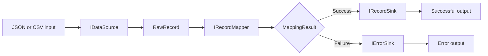

# ConsoleAppDataPipeline

A small, extensible data-processing pipeline written in C#. The application reads records from a structured input source, converts them into a common `RawRecord` representation, validates and maps them to domain objects, and routes successful records and mapping errors to separate outputs.

The current example processes `User` records and supports both JSON and CSV input.

## Features

- JSON and CSV data sources
- Asynchronous record processing with `IAsyncEnumerable<T>`
- Shared mapping and validation logic for different input formats
- Separate sinks for successful records and validation errors
- JSON output written incrementally with `Utf8JsonWriter`
- Cancellation support through `CancellationToken`
- Execution statistics: total, successful, failed records, and duration
- Generic pipeline components that can be extended for other domain models

## Processing flow



Both `JsonDataSource<T>` and `CsvDataSource<T>` create `RawRecord` instances. This allows the same mapper and validation rules to be reused regardless of the original input format.

## Current user validation rules

`UserMapper` validates the following fields:

- `Name` is required and cannot exceed 100 characters.
- `Email` is required, cannot exceed 254 characters, and must match a basic email format.
- `Age` must be an integer greater than or equal to zero.

A valid record is mapped to:

```csharp
public record User(string Name, string Email, int Age);
```

## Project structure

```text
ConsoleAppDataPipeline/
├── DataSources/
│   ├── CsvDataSource.cs
│   └── JsonDataSource.cs
├── Interfaces/
│   ├── IDataSource.cs
│   ├── IErrorSink.cs
│   ├── IPipelineRunner.cs
│   ├── IRecordMapper.cs
│   └── IRecordSink.cs
├── Mappers/
│   ├── MappingError.cs
│   ├── MappingResult.cs
│   └── UserMapper.cs
├── Models/
│   ├── RawRecord.cs
│   └── User.cs
├── Runners/
│   ├── PipelineRunner.cs
│   └── PipelineRunnerStatistics.cs
├── Sinks/
│   ├── JsonErrorSink.cs
│   ├── JsonRecordSink.cs
│   ├── UserConsoleErrorSink.cs
│   └── UserConsoleRecordSink.cs
└── Program.cs
```

## Requirements

- .NET 10 SDK

Check the installed SDK:

```bash
dotnet --version
```

## Input example

The current `Program.cs` uses `JsonDataSource<User>` and reads from:

```text
input/users.json
```

Example input:

```json
[
  {
    "Name": "Anna Kowalska",
    "Email": "anna@example.com",
    "Age": 27
  },
  {
    "Name": "John Smith",
    "Email": "invalid-email",
    "Age": 31
  },
  {
    "Name": "Michael Brown",
    "Email": "michael@example.com",
    "Age": -2
  }
]
```

The root JSON value must be an array, and every item must be an object.

A CSV source can use equivalent columns:

```csv
Name,Email,Age
Anna Kowalska,anna@example.com,27
John Smith,invalid-email,31
Michael Brown,michael@example.com,-2
```

## Running the application

Create the input directory and add `users.json`:

```text
input/users.json
```

Then run:

```bash
dotnet restore
dotnet run
```

The application creates the output directory automatically.

## Output

Successful records are written to:

```text
output/users.json
```

Example:

```json
[
  {
    "Name": "Anna Kowalska",
    "Email": "anna@example.com",
    "Age": 27
  }
]
```

Validation errors are written to:

```text
output/errors.json
```

Each failed input record produces a collection of mapping errors. Example:

```json
[
  [
    {
      "Field": "Email",
      "Message": "Email is invalid",
      "RawValue": "invalid-email"
    }
  ],
  [
    {
      "Field": "Age",
      "Message": "Age must be greater than or equal to zero",
      "RawValue": "-2"
    }
  ]
]
```

After processing, execution statistics are printed to the console:

```text
Total: 3, Successful: 1, Failed: 2, Duration: 00:00:00.0123456
```

## Switching the input source

The pipeline runner does not depend on a concrete input format. To process CSV instead of JSON, replace the source and input stream in `Program.cs`:

```csharp
IDataSource<User> dataSource = new CsvDataSource<User>();
await using Stream fileStream = File.OpenRead("input/users.csv");
```

The mapper, runner, record sink, and error sink can remain unchanged.

## Using console sinks

Successful records and errors can also be written to the console:

```csharp
IRecordSink<User> recordSink = new UserConsoleRecordSink();
IErrorSink errorSink = new UserConsoleErrorSink();
```

## Extending the pipeline

### Add another domain model

1. Create the model.
2. Implement `IRecordMapper<T>` for that model.
3. Register the appropriate data source and sinks in the composition root.
4. Construct `PipelineRunner<T>` with those components.

### Add another input format

Implement:

```csharp
public interface IDataSource<T> where T : class
{
    IAsyncEnumerable<MappingResult<T>> ReadAsync(
        Stream stream,
        IRecordMapper<T> mapper,
        CancellationToken cancellationToken = default);
}
```

The new source should convert each source record into a `RawRecord` and pass it to the supplied mapper.

### Add another output

Implement either:

```csharp
IRecordSink<T>
```

or:

```csharp
IErrorSink
```

No changes to `PipelineRunner<T>` are required.

## Design notes

- `RawRecord` provides a shared intermediate representation for multiple source formats.
- `MappingResult<T>` represents expected validation failures without using exceptions for normal control flow.
- `PipelineRunner<T>` coordinates processing but does not contain format-specific parsing, validation, or output logic.
- JSON sinks implement `IAsyncDisposable` because they own file streams and must close the JSON array when processing finishes.
- The caller creates and disposes streams and disposable sinks.

## Planned improvements

- Unit tests for data sources, mapper, runner, sinks, and cancellation
- Dependency injection configuration
- Better CSV parsing for quoted values and embedded commas
- Streaming JSON input without loading the complete document into memory
- Structured error output containing the source row number
- Command-line configuration for input format and file paths
